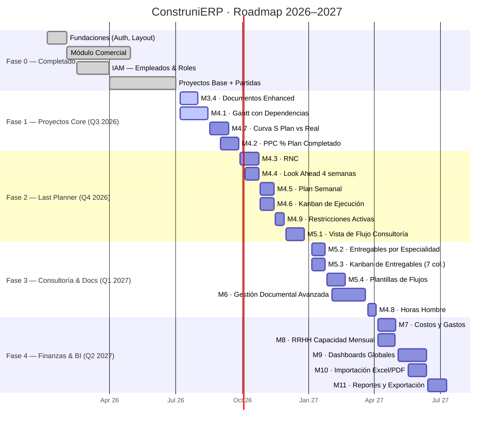

# ConstruniERP — Alcance del Sistema y Plan de Desarrollo
**Versión**: 1.0 · **Fecha**: 2026-07-01 · **Autor**: Equipo Desarrollo Construni

---

## 1. Descripción General

ConstruniERP es un sistema de gestión empresarial para empresas de ingeniería y arquitectura que operan en dos modalidades:

- **Proyectos de Obras** — Metodología Last Planner® adaptada (PPC, partidas, avance físico por metrado)
- **Proyectos de Consultoría** — Gestión de entregables, flujos de proceso y versionamiento de planos

El sistema integra módulos de gestión comercial, control de proyectos, recursos humanos y control documental en una plataforma unificada.

### Stack Tecnológico

| Capa | Tecnología |
|------|-----------|
| Frontend | SvelteKit 5 (runes mode), Tailwind CSS, Chart.js |
| Backend | Supabase (PostgreSQL + Auth + Storage + RLS) |
| Archivos | Google Drive API (OAuth2 refresh token) |
| Desktop | Tauri v1 (Windows / macOS / Linux) |
| Mobile | Tauri v2 (Android — futuro) |
| Deploy | adapter-static (SPA), fallback: index.html |

---

## 2. Módulos del Sistema

### ✅ FASE 0 — Completado (Ene–Jun 2026)

#### M0 · Fundaciones
- Auth con Supabase (login, logout, sesión persistente)
- Layout: Sidebar de navegación + Topbar con usuario
- Dashboard general ERP con KPIs de resumen

#### M1 · Módulo Comercial
- **Ventas**: CRUD completo, código generado automático, pipeline comercial
- **Contratos y Proformas**: Upload a Google Drive con URL persistida en BD
- **Clientes**: CRUD con búsqueda
- **Proveedores**: CRUD con búsqueda

#### M2 · IAM — Identity & Access Management
- **Empleados**: CRUD + vinculación con `auth_user_id` de Supabase
- **Roles y Permisos**: Gestión de roles de acceso al sistema

#### M3 · Proyectos Base
- **Lista de Proyectos**: Vista portfolio con cards y KPIs de resumen
- **Ficha de Proyecto**: Detalle con tabs (Resumen, Cronograma, Partidas, Documentos)
- **Gestión de Partidas**: TreeView jerárquico con plantillas, HH, unidades y metrados
- **Documentos Básicos**: Upload a Google Drive, tabla con estados y búsqueda

---

### 🔄 FASE 1 — Proyectos Core (Q3 2026, Jul–Sep)

#### M3.4 · Documentos Enhanced
- [ ] Visor de documentos PDF inline (iFrame + fallback a link externo)
- [ ] Plantillas de documentos: Project Charter, Acta de Inicio, Carta de Conformidad, Acta de Entrega, RFI, Informe Técnico, Informe de Avance, Lecciones Aprendidas, Acta de Cierre
- [ ] Editor WYSIWYG para redactar documentos desde plantilla
- [ ] Versionamiento: múltiples versiones con historial (v0.1 → V1.0)
- [ ] Flujo de aprobación: Borrador → Revisión Técnica → Aprobación Especialidades → Aprobación JP → Emitido
- [ ] Comentarios por documento
- [ ] Matriz de aprobación por especialidad (ARQ, EST, ELE, SAN…)
- [ ] Historial de aprobaciones en timeline con firma

#### M4.1 · Gantt con Dependencias
- [ ] Visualización de partidas en barras de Gantt (jerárquico, colapsable)
- [ ] Plan Base vs Avance Real (doble barra superpuesta, % sobre la barra)
- [ ] Dependencias entre tareas (líneas de conexión con flecha)
- [ ] Toggle: vista por Partida / Rol del Equipo / Ruta Crítica
- [ ] Toggle: Avance Real / Dependencias / Cursor de Fecha / Hoy
- [ ] Configuración de días hábiles: L–V / L–S / Todos los días
- [ ] Tolerancia %: 0, 10, 20, 30, 50, 75, 100
- [ ] Indicador Plan vs Real: N atrasadas · N adelantadas · N en tiempo
- [ ] Plan Base con fecha guardable/editable
- [ ] Imprimir Gantt (PDF)

#### M4.7 · Curva S
- [ ] Gráfica acumulada multi-línea: Plan Base, Planeado, Real Físico, Real Financiero
- [ ] Timeline semanal (S0 → SN) con selector de rango
- [ ] Indicador Δ vs Plan (diferencial porcentual con color)
- [ ] KPIs circulares: Avance Físico % + Financiero %
- [ ] Selector de sub-obra (partida padre)
- [ ] Barra de tiempo: días transcurridos / semana actual / días restantes

#### M4.2 · PPC — % Plan Completado
- [ ] Registro semanal de compromisos (planificadas vs completadas)
- [ ] Cálculo automático: PPC = (cumplidas / comprometidas) × 100
- [ ] Histórico semanal en tabla + gráfica de barras
- [ ] PPC promedio de 4 semanas (indicador circular)
- [ ] Causas de no cumplimiento con códigos: CLI-MAT, CLI-ING, CLI-PRI, CLI-CAM, MAT, DT, AP, EXT, EE, QC, PER, EQ, PROG, IOF
- [ ] Gráfica de causas (pie) + gráfica por responsable (pie: Cliente / Constructor)

---

### ⬜ FASE 2 — Last Planner Completo (Q4 2026, Oct–Dic)

#### M4.3 · RNC — Razones de No Cumplimiento
- [ ] CRUD de RNC con categoría: Cliente, Información, Recursos, Coordinación Interna, Cambios de Alcance
- [ ] Origen: Externo (cliente, terceros) / Interno (consultora)
- [ ] KPIs: PPC del período, RNC registradas, índice de impacto, categoría/origen principal
- [ ] Compromisos afectados por cada RNC
- [ ] Gráficas: donut por categoría, donut por origen, tendencia mensual (línea)
- [ ] RNC por especialidad afectada (barras horizontales: ARQ, EST, INST, ELE…)
- [ ] Lecciones Aprendidas: registro, listado y búsqueda
- [ ] Filtro por período (mes/semana)

#### M4.4 · Look Ahead (4 semanas)
- [ ] Vista de entregables/actividades de las próximas 4 semanas
- [ ] Estado por actividad: 🟢 Listo / 🟡 Con restricción / 🔴 No listo
- [ ] Conteo de entregables clave y % listo por semana
- [ ] Enlace directo a restricciones activas relacionadas

#### M4.5 · Plan Semanal
- [ ] Vista calendario L–S con actividades de la semana actual
- [ ] Actividades asignadas por día con responsable y horas estimadas
- [ ] Total horas planificadas por día
- [ ] Navegación entre semanas (anterior / siguiente)

#### M4.6 · Kanban de Ejecución (semana)
- [ ] Columnas: Por Hacer / En Proceso / En Revisión / Aprobado
- [ ] Cards de actividades/entregables con asignado y proyecto
- [ ] Conteo por columna
- [ ] Filtro por responsable y disciplina

#### M4.9 · Restricciones Activas
- [ ] Lista: actividad afectada, proyecto, impacta a, responsable, acción, estado
- [ ] Estados: Abierta / En Seguimiento / Resuelta
- [ ] Filtro por proyecto y estado

#### M5.1 · Vista de Flujo (Consultoría)
- [ ] Diagrama visual de etapas numeradas con flechas y flujos condicionales
- [ ] Flujos condicionales: Aprobado → siguiente / Rechazado → Correcciones
- [ ] Panel lateral: etapa seleccionada con responsable, fechas, % avance, entregables
- [ ] Tabla de detalle de etapas (estado, responsable, inicio, fin previsto, avance, duración objetivo)
- [ ] Resumen del flujo: donut (Completadas / En proceso / Pendientes / Retrasadas)
- [ ] Métricas: duración total prevista, tiempo transcurrido, avance general %

---

### ⬜ FASE 3 — Consultoría & Docs Avanzados (Q1 2027, Ene–Mar)

#### M5.2 · Entregables por Especialidad
- [ ] Lista: nombre, especialidad, responsable, fecha comprometida, estado, % avance
- [ ] Estados: En proceso / En revisión / Observado / Aprobado / Entregado
- [ ] % avance editable inline
- [ ] Filtros por especialidad y estado
- [ ] Indicadores PPC de entregables (semanal y promedio 4 sem.)

#### M5.3 · Kanban de Entregables (7 columnas)
- [ ] Columnas: Pendiente / En Proceso / En Revisión Interna / Observado / Corrección / Aprobado / Entregado
- [ ] Cards agrupadas por especialidad (ARQ, EST, ELE, SAN, BIM…)
- [ ] Mover entre columnas (drag-and-drop)

#### M5.4 · Plantillas de Flujos de Proceso
- [ ] CRUD de plantillas de flujo
- [ ] 9 tipos predefinidos:
  - Vivienda Multifamiliar (12 etapas)
  - Regularización SUNARP (8 etapas)
  - Licencia de Construcción (10 etapas)
  - Expediente Técnico (15 etapas)
  - Habilitación Urbana (11 etapas)
  - Ampliación / Remodelación (7 etapas)
  - Locales Comerciales (9 etapas)
  - Institucional / Educativo (13 etapas)
  - Industrial (12 etapas)
- [ ] Editor de etapas: nombre, responsable (rol), duración objetivo, tipo (lineal / condicional)
- [ ] Vista Diagrama vs Vista Lista
- [ ] Duplicar y exportar plantilla
- [ ] Marcar como plantilla por defecto por tipo de proyecto

#### M4.8 · Horas Hombre
- [ ] Registro de HH por empleado, semana y disciplina
- [ ] Planificado vs Asignado vs Ejecutado
- [ ] Gráfica de barras por disciplina (ARQ, EST, INST, BIM, MUN…)
- [ ] Carga de trabajo % (horas asignadas / capacidad disponible)

---

### ⬜ FASE 4 — Finanzas & BI (Q2 2027, Abr–Jun)

#### M7 · Costos y Gastos
- [ ] Captura de gastos por partida con fecha, monto y responsable
- [ ] Estimaciones y aprobaciones de gasto
- [ ] Distribución del gasto por partida (pie chart)
- [ ] Presupuesto vs Ejecutado por partida (tabla + gráfica)
- [ ] Actividad reciente de movimientos financieros

#### M8 · RRHH — Capacidad Mensual
- [ ] Capacidad mensual por empleado (HH disponibles)
- [ ] Asignación a proyectos activos
- [ ] Carga de trabajo % por persona y por mes (tabla + visual)
- [ ] Vista de equipo con total de capacidad instalada

#### M9 · Dashboards Globales
- **M9.1 Portfolio "Mis Proyectos"**: KPIs globales (proyectos activos, presupuesto total, total gastado, avance promedio), cards con avance circular, filtro Activos/Terminados/Archivados, Import Excel/PDF, Nuevo Proyecto
- **M9.2 Last Planner Dashboard Global**: PPC semana pasada + PPC promedio 4 sem., pendientes globales, priorización de proyectos (score), Look Ahead global, restricciones activas, trabajo listo sin restricciones, plan semanal, kanban global, análisis de incumplimiento, horas hombre, pizarra interactiva (embed Miro)
- **M9.3 Dashboard Consultoría Global**: Plan maestro multi-proyecto (Gantt), indicadores PPC de entregables, observaciones por semana, control documental global

#### M10 · Importación Excel/PDF
- [ ] Importar proyecto desde Excel (formato: Ejemplo Proyecto Obra.xlsx)
- [ ] Importar partidas con metrados, unidades y programación semanal
- [ ] Importar PPC histórico por semanas

#### M11 · Reportes y Exportación
- [ ] Informe de avance semanal automático (PDF)
- [ ] Exportar Curva S como imagen o PDF
- [ ] Exportar histórico PPC
- [ ] Exportar Gantt imprimible (PDF)

---

## 3. Lista de Tareas de Desarrollo

| # | Módulo | Tarea | Prior. | Esfuerzo | Estado |
|---|--------|-------|--------|----------|--------|
| 01 | M3.4 Documentos | Visor PDF inline | P1 | 3d | ⬜ Pendiente |
| 02 | M3.4 Documentos | Flujo de aprobación multi-especialidad | P1 | 5d | ⬜ Pendiente |
| 03 | M3.4 Documentos | Editor WYSIWYG + plantillas | P2 | 8d | ⬜ Pendiente |
| 04 | M3.4 Documentos | Versionamiento (v0.1 → V1.0) | P2 | 4d | ⬜ Pendiente |
| 05 | M3.4 Documentos | Comentarios + matriz de aprobación | P2 | 3d | ⬜ Pendiente |
| 06 | M4.1 Gantt | Barras jerárquicas colapsables | P1 | 8d | ⬜ Pendiente |
| 07 | M4.1 Gantt | Plan Base vs Avance Real | P1 | 5d | ⬜ Pendiente |
| 08 | M4.1 Gantt | Dependencias entre tareas | P2 | 6d | ⬜ Pendiente |
| 09 | M4.1 Gantt | Ruta crítica highlight | P3 | 4d | ⬜ Pendiente |
| 10 | M4.1 Gantt | Config días hábiles + tolerancia | P2 | 2d | ⬜ Pendiente |
| 11 | M4.7 Curva S | Gráfica multi-línea acumulada | P1 | 5d | ⬜ Pendiente |
| 12 | M4.7 Curva S | KPIs circulares avance físico/financiero | P1 | 2d | ⬜ Pendiente |
| 13 | M4.2 PPC | Registro semanal de compromisos | P1 | 4d | ⬜ Pendiente |
| 14 | M4.2 PPC | Histórico semanal + gráfica | P1 | 3d | ⬜ Pendiente |
| 15 | M4.2 PPC | Causas de incumplimiento (pie chart) | P1 | 3d | ⬜ Pendiente |
| 16 | M4.3 RNC | CRUD con categorías y origen | P1 | 5d | ⬜ Pendiente |
| 17 | M4.3 RNC | KPIs + gráficas (donut, tendencia, especialidad) | P1 | 5d | ⬜ Pendiente |
| 18 | M4.3 RNC | Lecciones Aprendidas | P2 | 3d | ⬜ Pendiente |
| 19 | M4.4 Look Ahead | Vista 4 semanas con estados | P2 | 4d | ⬜ Pendiente |
| 20 | M4.5 Plan Semanal | Calendario semanal con actividades | P2 | 5d | ⬜ Pendiente |
| 21 | M4.6 Kanban Ejec. | Tablero 4 columnas | P2 | 4d | ⬜ Pendiente |
| 22 | M4.9 Restricciones | Lista con estados y responsables | P2 | 3d | ⬜ Pendiente |
| 23 | M5.1 Vista Flujo | Diagrama visual de etapas | P1 | 8d | ⬜ Pendiente |
| 24 | M5.1 Vista Flujo | Panel detalle + métricas del flujo | P2 | 4d | ⬜ Pendiente |
| 25 | M5.2 Entregables | Lista con % avance editable inline | P1 | 4d | ⬜ Pendiente |
| 26 | M5.3 Kanban Entregables | Tablero 7 columnas | P2 | 4d | ⬜ Pendiente |
| 27 | M5.4 Plantillas Flujos | CRUD + 9 tipos predefinidos | P2 | 6d | ⬜ Pendiente |
| 28 | M5.4 Plantillas Flujos | Editor de etapas + Vista Diagrama | P3 | 5d | ⬜ Pendiente |
| 29 | M6 Docs Avanzados | PDF viewer + plantillas + versiones completo | P1 | 10d | ⬜ Pendiente |
| 30 | M4.8 Horas Hombre | Registro HH + gráficas por disciplina | P2 | 5d | ⬜ Pendiente |
| 31 | M7 Costos | Captura gastos + distribución por partida | P2 | 8d | ⬜ Pendiente |
| 32 | M8 RRHH | Capacidad mensual + asignación | P3 | 6d | ⬜ Pendiente |
| 33 | M9.1 Portfolio | Dashboard "Mis Proyectos" mejorado | P2 | 5d | ⬜ Pendiente |
| 34 | M9.2 Last Planner Global | Dashboard global Last Planner completo | P3 | 10d | ⬜ Pendiente |
| 35 | M9.3 Consultoría Dashboard | Dashboard global Consultoría | P3 | 8d | ⬜ Pendiente |
| 36 | M10 Importación | Import desde Excel (Ejemplo Obra.xlsx) | P3 | 8d | ⬜ Pendiente |
| 37 | M11 Reportes | Generación PDF (avance, PPC, Curva S, Gantt) | P3 | 6d | ⬜ Pendiente |

**Total estimado**: ~193 días de desarrollo · 1 dev → ~9.5 meses · 2 devs → ~5 meses

---

## 4. Gantt de Desarrollo

> Renderizable en GitHub, Notion, VS Code (extensión Markdown Preview Mermaid) o mermaid.live

---

## 5. Base de Datos — Migraciones Pendientes

| Tabla | Módulo | Estado |
|-------|--------|--------|
| `documento_proyecto` | M3.4 Documentos | ✅ Creada (en BD_reset + DER2) |
| `version_documento` | M3.4 / M6 | ⬜ Pendiente |
| `aprobacion_documento` | M3.4 / M6 | ⬜ Pendiente |
| `compromiso_ppc` | M4.2 PPC | ⬜ Pendiente |
| `rnc` | M4.3 RNC | ⬜ Pendiente |
| `restriccion` | M4.9 | ⬜ Pendiente |
| `entregable` | M5.2 | ⬜ Pendiente |
| `flujo_proceso` | M5.1 | ⬜ Pendiente |
| `flujo_etapa` | M5.1 | ⬜ Pendiente |
| `plantilla_flujo` | M5.4 | ⬜ Pendiente |
| `horas_hombre` | M4.8 / M8 | ⬜ Pendiente |
| `gasto` | M7 | ⬜ Pendiente |

## 6. Dependencias de Terceros

| Librería | Uso | Estado |
|---------|-----|--------|
| Chart.js | Curva S, PPC, RNC charts | ✅ Instalada |
| PDF.js | Visor PDF inline (M3.4 / M6) | ⬜ Por instalar |
| TipTap o Quill | Editor WYSIWYG plantillas (M6) | ⬜ Por instalar |
| @formkit/drag-and-drop | Kanban drag & drop (M4.6, M5.3) | ⬜ Por instalar |

## 7. Consideraciones Tauri

- Las rutas `/api/*` solo funcionan en dev/web; en build Tauri (`adapter-static`) no están disponibles. Las llamadas a `/api/upload-document` requieren servidor web desplegado o reemplazarse con llamadas directas a Supabase Storage.
- Para Android (Tauri v2): migrar `reqwest::blocking` → async en `src-tauri/src/main.rs`.
- `PUBLIC_API_BASE_URL` debe configurarse en `.env` para builds de producción Tauri.

---

*Generado: 2026-07-01 · ConstruniERP v0.4 en desarrollo activo*
